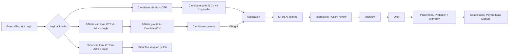

# Bàn giao ChatGPT Plus — HR Connect

Ngày bàn giao: 05/10/2026 (GMT+7)  
Repository: `https://github.com/hoangqui794/hr-connect`  
Workspace thường dùng: `D:\Ki_9\HRConnect\HRConnect`

## Cách làm việc cần giữ

- Người dùng gọi trợ lý là **VIKI**; trả lời bằng tiếng Việt, dễ hiểu, gần gũi.
- Làm trực tiếp trong code folder khi được yêu cầu.
- Tạo nhánh mới theo dạng `feature/<ten-chuc-nang>`, không dùng `codex/`.
- Khi hoàn thành một API hoặc một nhóm thay đổi nghiệp vụ độc lập: chạy kiểm tra phù hợp, commit và **push ngay**.
- Chỉ merge vào `dev` hoặc `main` khi người dùng yêu cầu rõ.
- Không đưa secret/API key/token vào Git, log, audit log hoặc tài liệu.
- Khi thêm permission mới: phải thêm vào seeder và gán mặc định cho role phù hợp.
- Khi thay đổi database: cần có migration, kiểm tra foreign key/transaction để không tạo lỗi 500 hoặc dữ liệu mồ côi.

## Dự án

HR Connect là nền tảng tuyển dụng kết nối Candidate, Affiliate Recruiter, Client Company, HR/Admin và các dịch vụ AI. Backend là ASP.NET Core/.NET 8 theo Clean Architecture:

- `HRConnect.Domain`: entity và nghiệp vụ cốt lõi.
- `HRConnect.Application`: command/query, validation, interface.
- `HRConnect.Infrastructure`: EF Core/PostgreSQL, repository, R2 storage, Resend email, background worker, tích hợp MF03.
- `HRConnect.Presentation`: Minimal API endpoints, Swagger, xác thực và rate limit.
- `HRConnect.UnitTests`: unit/integration-oriented test cho các luồng nghiệp vụ.

## Các Main Flow

| MF | Chức năng | Trạng thái/phụ trách |
| --- | --- | --- |
| MF01 | Account, Auth, role/permission, đăng ký OTP và Admin approval | Audit Auth/Admin cho đăng ký, approval, mật khẩu và session đã hoàn thành trên nhánh feature. |
| **MF02** | Candidate/CV submission, duplicate check, attribution, Candidate consent, trigger AI | **Đây là phần trọng tâm người dùng phụ trách.** Luồng chính đã khá hoàn chỉnh. |
| MF03 | AI matching/chấm điểm CV so với Job, hỗ trợ reviewer sàng lọc | Dev khác phụ trách. MF02 chỉ tạo queue/outbox để gọi MF03. |
| MF04+ | Tuyển dụng tiếp theo: screening, interview, offer, placement, commission/payout | Dev khác phụ trách. |

## Actor, role và phạm vi chính

| Actor / role | Mục đích chính |
| --- | --- |
| Guest | Đăng ký, đăng nhập, xác thực OTP, xem service type công khai. |
| Candidate | Quản lý profile/CV, trực tiếp ứng tuyển, xem Application và consent do Affiliate tạo. |
| Affiliate Recruiter | Quản lý profile, Candidate library, submit Candidate/CV, theo dõi submission, attribution và hoa hồng của mình. |
| Client Company User | Quản lý company/profile, tạo/quản lý Job và theo dõi Candidate/Application thuộc Job công ty. |
| Internal HR | Review Job, xem AI score/CV theo quyền, xử lý screening/interview/offer/placement. |
| Admin | Quản lý user, approval, service type, commission rule/milestone, audit log và cấu hình nghiệp vụ. |
| MF03 service | Gọi Internal API bằng service token để nhận/sử dụng dữ liệu chấm điểm AI. |

Role và permission là nguồn quyết định quyền truy cập. Không chỉ dựa vào role claim cũ trong JWT: lúc login/refresh, role và permission inactive phải bị lọc.

## Bản đồ API theo Swagger

Swagger tại môi trường local thường là `http://localhost:5041/swagger`. Các tag/group hiện có:

| Swagger group | Nội dung |
| --- | --- |
| Auth | Register Candidate/Affiliate/Client, OTP, login, refresh, logout, password reset/change. |
| Users | Thông tin user dùng chung. |
| Candidate Profile / Candidate CV / Candidate Applications | Profile, kho CV, CV primary, apply và lịch sử ứng tuyển. |
| Jobs / Job Review | Job công khai/nội bộ, create-review-publish và Candidate/Affiliate submit vào Job. |
| Company Profile | Profile Company và các dữ liệu doanh nghiệp. |
| Affiliate Profile / Candidate Library / Submissions / Referral Progress / Attributions | Nghiệp vụ Affiliate, kho Candidate/CV và theo dõi nguồn giới thiệu. |
| Submission Consents / Candidate Submission Consents | Xem, confirm, decline, resend consent. |
| Internal HR Profile / Internal HR AI Screening | HR review, AI score/sàng lọc. |
| Interviews / Offers / Placements | Pipeline tuyển dụng sau Application. |
| Service Types | Service type công khai và mapping quyền được phép nộp Job. |
| Admin Users / Profile / Approvals / Audit Logs | User management, duyệt Client/Affiliate, audit. |
| Admin Service Types / Commission Rules | Cấu hình service type, commission rule/milestone. |
| Internal APIs - CV Management / Internal AI Integration | Endpoint nội bộ dùng service authentication cho MF03. |

Khi thêm endpoint: đặt tag đúng nhóm, mô tả actor/permission, request schema, response schema, và tất cả status code nghiệp vụ trên Swagger.

## Domain và database cốt lõi

### Identity, authorization và onboarding

| Bảng/entity | Vai trò |
| --- | --- |
| `app_user` / `AppUser` | Tài khoản nền tảng; email, phone, status, `email_verified_at`. |
| `role`, `permission`, `user_role`, `role_permission` | RBAC. `user_role.status`, `role.is_active`, `permission.is_active` đều quan trọng. |
| `user_token` | OTP email, OTP reset mật khẩu; chỉ giữ hash, expiry, attempt và used time. |
| `refresh_token` | Session/refresh rotation, revoke reason, token reuse detection. |
| `affiliate_application` | Hồ sơ Affiliate trước approval. |
| `affiliate_profile` | Profile Affiliate hoạt động sau approval. |
| `company`, `company_user`, `company_verification_request` | Company và luồng Client đăng ký/chờ duyệt. |
| `candidate` | Hồ sơ Candidate; có thể tồn tại trước account với `user_id = NULL`. |

### Recruitment và CV

| Bảng/entity | Vai trò |
| --- | --- |
| `job`, `job_requirement`, `job_skill`, `job_status_history` | Job, yêu cầu, kỹ năng và lifecycle Job. |
| `candidate_cv` | Metadata CV; file nằm Cloudflare R2, liên kết bằng `candidate_id`. |
| `submission` | Lần Candidate/Affiliate nộp vào Job; lưu cả accepted/blocked/pending consent. |
| `submission_consent` | One-time consent khi Affiliate nộp hộ Candidate. |
| `application`, `application_status_history` | Đơn ứng tuyển hợp lệ sau khi Candidate tự apply hoặc consent. |
| `attribution` | Nguồn Affiliate cho Application, dùng cho commission/dispute sau này. |
| `candidate_job_match`, `ai_match_result`, `match_tier_config` | Kết quả/cấu hình AI matching MF03. |

### Pipeline và tài chính

| Bảng/entity | Vai trò |
| --- | --- |
| `interview`, `interview_participant`, `interview_status_history` | Phỏng vấn. |
| `offer`, `offer_approval` | Offer và approval offer. |
| `placement`, `probation`, `warranty` | Placement, thử việc, bảo hành. |
| `commission_rule`, `commission_milestone`, `commission`, `commission_adjustment`, `payout` | Tính và chi trả commission. |
| `dispute` | Tranh chấp attribution/commission. |

### Cross-cutting

| Bảng/entity | Vai trò |
| --- | --- |
| `notification` | Thông báo trong hệ thống. |
| `email_outbox` | Email cần gửi bền vững; có status/retry/error. |
| `audit_log` | Lịch sử audit append-only. |
| `service_type`, `service_type_allowed_role` | Service type và role được phép tham gia/nộp Job. |

## Tích hợp và background worker

| Thành phần | Trách nhiệm |
| --- | --- |
| Cloudflare R2 | Lưu file CV. Chỉ phát URL có chữ ký, có hạn; không lưu file binary trong database. |
| Resend | Gửi email OTP, approval và consent. Không log nội dung OTP. |
| `Mf03ScoringDispatcher` | Lấy yêu cầu MF03 từ queue/outbox, gọi AI service, backoff/retry có giới hạn; chuyển `FAILED` khi cạn retry. |
| `SubmissionConsentExpiryWorker` | Hết hạn consent, archive CV theo rule, cập nhật Submission và audit. |
| `AccountLifecycleEmailOutboxWorker` | Gửi email đã xác thực/chờ duyệt/kết quả Admin từ outbox; retry tối đa 5 lần. |

Configuration lấy từ `.env` là môi trường chính. `.env.example` chỉ là mẫu cho dev khác, không được ghi đè `.env` hoặc commit secret. Các cấu hình thường gặp: DB connection, JWT, Resend, R2, URL consent, MF03 base URL/service token, giới hạn file và URL expiry.

## Quy tắc database và transaction quan trọng

1. Thay đổi business phụ thuộc nhiều bảng phải cùng transaction: ví dụ Candidate + CV metadata + Submission + Application + Attribution, hoặc approval + user role + email outbox + audit.
2. Không upload/lưu metadata CV rồi mới tạo Application ngoài transaction nếu có thể để lại Candidate/CV mồ côi khi bước sau lỗi.
3. Dùng unique constraint làm lớp chống trùng cuối cùng, ngoài kiểm tra trước transaction.
4. Foreign key lỗi không được biến thành HTTP 500 mơ hồ: validate ownership/trạng thái trước, map conflict/business error rõ ràng.
5. Dữ liệu lịch sử như Application, Submission, Attribution, Audit không xoá cứng chỉ vì CV bị archive hoặc quyền tái sử dụng bị thu hồi.

## Luồng nghiệp vụ toàn hệ thống theo vòng đời



Điểm phân ranh quan trọng: `Submission` không đồng nghĩa `Application`. Submission của Affiliate chỉ thành Application sau consent hợp lệ. Client chỉ theo dõi Candidate từ Application hợp lệ, không thấy consent pending/declined/expired như một ứng viên chính thức.

## Auth và approval — business chuẩn

### Registration

- **Candidate**: đăng ký → nhận OTP → xác thực email → user `ACTIVE`; Candidate mới được tạo hoặc Candidate business data chưa có account được liên kết bằng email đã xác thực.
- **Affiliate**: đăng ký → OTP → `affiliate_application = UNDER_REVIEW` → Admin duyệt → profile `ACTIVE`, user `ACTIVE`, role `AFFILIATE_RECRUITER` active.
- **Client**: đăng ký Company + CompanyUser + verification request → OTP → `UNDER_REVIEW` → Admin duyệt → Company `VERIFIED`, user `ACTIVE`, role `CLIENT_COMPANY_USER` active.
- Không được Admin approve/reject trước khi `EmailVerifiedAt` có giá trị.
- Nếu OTP hết hạn hoặc hết số lần thử, user phải dùng API resend đúng luồng; không tự replay OTP cũ.

### Login/session

- Login/refresh chặn user pending, locked, suspended, disabled hoặc profile registration bị rejected.
- JWT mới chỉ chứa role active, user role active và permission active.
- Access token đã phát hành không thể tự mất claim ngay khi admin tắt permission; mitigation hiện tại là thời hạn access token ngắn + refresh kiểm tra DB. Nếu yêu cầu revocation tức thời ở production, cần bổ sung token-version/session validation tại request layer.
- Refresh token rotation: mỗi refresh hợp lệ thay token; dùng lại token đã revoked/replaced là sự kiện bảo mật, phải revoke tất cả session của user.

### Admin approval

- Approval list chỉ bao gồm hồ sơ đã OTP và `UNDER_REVIEW`/các trạng thái review hợp lệ; không được lộ `PENDING` chưa xác thực.
- `affiliate.verify` chỉ truy cập Affiliate approval; `company.verify` chỉ truy cập Client approval; chỉ Admin hoặc user có cả hai quyền mới xem unified list.
- Email under-review/result dùng `email_outbox`; business update, audit và outbox phải cùng transaction.

## Bảo mật và vận hành production

### Hiện có

- JWT bearer; Swagger tự thêm prefix `Bearer`, người test chỉ dán raw access token.
- Internal APIs dùng header `X-Service-Token`, không dùng JWT end-user.
- Request correlation: API tạo/trả `X-Correlation-ID`; audit/log dùng cùng correlation id.
- Forwarded headers chỉ tin cậy khi cấu hình `ForwardedHeaders__KnownProxies__*`; bắt buộc cấu hình reverse proxy thật ở production để IP audit/rate limit đúng.
- Rate limits:
  - `auth-login`: 10 request/IP/phút.
  - `auth-sensitive`: 5 request/IP/10 phút.
  - `auth-registration`: 5 request/IP/giờ.
  - `submission-consent`: 10 request/(IP + user)/giờ.
  - `submission-consent-public`: 20 request/IP/15 phút.
  - `candidate-application`: 10 request/(user + IP)/giờ.
- PDF validation, ownership check CV, presigned URL có hạn, redaction audit data.
- `email_outbox` retry email lifecycle tối đa 5 lần; lỗi cuối nằm ở `last_error` để support xử lý.

### Cần giữ khi deploy

- Không cấu hình CORS `AllowAnyOrigin` cho production public nếu FE domain đã xác định; giới hạn origin/method/header theo domain thật.
- Không dùng default JWT secret trong `Program.cs`; bắt buộc có secret production mạnh trong `.env`/secret store.
- Cấu hình trusted reverse proxies, HTTPS, database backup, log retention, R2 lifecycle và Resend verified domain.
- Giám sát email outbox `FAILED`, MF03 dispatch `FAILED`, consent sắp hết hạn và refresh token reuse.
- Không copy link presigned CV hoặc access token vào ticket/chat/log/audit.

## Migration, seed và khởi động local

1. Đặt `.env` trong hoặc ở đường dẫn cha của solution; app dùng `DotNetEnv.Env.TraversePath().Load()` rồi đọc environment variables.
2. Chạy migration đúng connection string trước khi test thủ công. `Program.cs` có startup migration/seed; vẫn cần kiểm tra log migration khi schema vừa thay đổi.
3. Với entity/constraint/index mới: tạo EF migration, review SQL PostgreSQL, chạy trên database sạch và database có dữ liệu seed.
4. Seeder là nguồn role/permission/service type demo. Bổ sung permission mới phải cập nhật seed role mapping, nếu không account demo/login sẽ có role nhưng không thực hiện được API.
5. Khởi chạy API: `dotnet run --project HRConnect.Presentation`; Swagger local thường `http://localhost:5041/swagger`.
6. Nếu build báo DLL bị lock bởi `HRConnect.Presentation`, dừng instance API đang chạy trước rồi build/run lại.

## Kiểm thử và chất lượng

- Build: `dotnet build HRConnect.sln --no-restore`.
- Full test: `dotnet test HRConnect.UnitTests/HRConnect.UnitTests.csproj --no-restore`.
- Với thay đổi nhỏ, ít nhất chạy targeted tests theo handler/service bị sửa rồi build solution.
- Luôn chạy `git diff --check` trước commit.
- Khi làm endpoint sensitive, test tối thiểu: unauthenticated (401), wrong permission (403), ownership khác (404 hoặc 403 theo policy), invalid input (400), conflict business (409), happy path và concurrent/retry nếu có transaction/outbox.
- Không viết test chỉ lặp lại implementation; test business boundary, ownership, duplicate, rollback và audit/outbox atomicity.

## Tài liệu hiện có trong repository

| File | Nội dung |
| --- | --- |
| `docs/mf02-candidate-consent.md` | Business + API consent MF02. |
| `docs/frontend-submission-consent-flow.md` | Hợp đồng FE cho consent Candidate có/không có account. |
| `docs/frontend-affiliate-candidate-library.md` | Hợp đồng FE Affiliate Candidate/CV library. |
| `docs/affiliate-referral-progress.md` | Theo dõi referral/submission Affiliate. |
| `docs/backend-client-job-candidate-pipeline.md` | Đặc tả API Client xem Candidate theo Job/pipeline; đọc trạng thái thực tế trước khi nói đã triển khai hết. |
| `docs/shared-audit-logging.md` | Kiến trúc audit chung, data rules, action đã phát hành. |

## Trạng thái chức năng theo module

| Module | Trạng thái bàn giao | Lưu ý |
| --- | --- | --- |
| Auth / OTP / approval | Hoạt động; audit đăng ký, mật khẩu, session và approval đã được bổ sung. | Không audit secret/token/hash. |
| RBAC / seed | Có role/permission và kiểm tra active khi login/refresh. | Permission mới phải seed + map role. |
| Candidate profile/CV | Có profile, nhiều CV, primary CV, storage R2 và ownership. | Cần tiếp tục policy quản lý CV Affiliate upload. |
| Job / service type | Có Job lifecycle và service type permission. | Client pipeline API có tài liệu; cần kiểm tra implementation với owner module. |
| MF02 submission/consent | Luồng core đã production-oriented. | Concurrency resend consent và CV reuse là backlog. |
| MF03 integration | MF02 queue/dispatcher/retry/manual retry đã có. | MF03 logic AI do dev khác sở hữu. |
| Recruitment MF04 | Có entities/endpoints cho Interview, Offer, Placement. | Không tự đổi business nếu owner MF04 chưa yêu cầu. |
| Finance / affiliate | Attribution, commission, payout, dispute có domain/API. | Cần owner module review policy commission end-to-end. |
| Audit | Platform, Auth/Admin, MF02 và MF04 đã có audit cho các thay đổi nghiệp vụ quan trọng. | Không audit secrets/PII không cần thiết. |

## Backlog sau bàn giao

### Auth/Admin vừa hoàn thành trên `feature/auth-admin-production-hardening`

1. Audit `PASSWORD_CHANGED`, `PASSWORD_RESET`, `SESSION_REVOKED`, `ALL_SESSIONS_REVOKED`, `REFRESH_TOKEN_REUSE_DETECTED`.
2. Audit và thay đổi password/session được lưu nguyên tử; logout một phiên giữ tính idempotent.
3. Refresh-token reuse được ghi với actor `SYSTEM`, không gán kẻ gọi là chủ tài khoản bị ảnh hưởng.

### Ưu tiên MF02 tiếp theo

1. Concurrency-safe resend consent: chỉ một request được đổi token và gửi email trong cooldown.
2. Candidate CV library cho `AFFILIATE_UPLOAD`: Candidate xem, quyết định cho phép/thu hồi tái sử dụng; Application lịch sử không bị hỏng.
3. Rà notification Affiliate cho consent confirmed/declined/expired ở API/UI thực tế.
4. Test manual toàn luồng: Affiliate submit Candidate có account, không account, mismatch identity, consent accept/decline/expire/resend, MF03 down và retry.

### Việc liên module cần phối hợp owner

- Client pipeline theo `docs/backend-client-job-candidate-pipeline.md`.
- MF03 contract, model response, scoring tier, SLA và error semantics.
- MF04 allowed status transition/commission milestone chính thức.
- Deployment hardening: CORS production, secrets store, monitoring, backup, alerting.

## Git protocol khi tiếp tục

1. `git fetch origin`; kiểm tra nhánh hiện tại và divergence trước khi sửa.
2. Nếu tiếp tục phần bàn giao: ở lại `feature/auth-admin-production-hardening`; nếu bắt đầu chức năng độc lập tạo `feature/<short-name>` từ branch mà user chỉ định.
3. Không force push, không reset mất commit người khác.
4. Trước push: build/test phù hợp, `git diff --check`, review `git status` để không commit `.env`, `bin`, `obj`, file CV hoặc secret.
5. Push sau một API/nhóm business hoàn chỉnh; báo user commit hash và phạm vi. Merge chỉ khi được yêu cầu.

## MF02 — nghiệp vụ đã thống nhất

### Hai nguồn nộp hồ sơ

1. **Candidate tự ứng tuyển**: chọn một CV có sẵn hoặc upload đúng một file PDF mới. Hệ thống kiểm tra job, service type, quyền nộp, Candidate hợp lệ và duplicate trước khi tạo Application.
2. **Affiliate Recruiter nộp hộ Candidate**: nhập Candidate/CV cho Job. Hệ thống resolve Candidate bằng email + phone, kiểm tra danh tính và duplicate, lưu Submission chờ Candidate consent.

### Candidate do Affiliate nộp

- Nếu Candidate đã tồn tại: submission liên kết với bản ghi `candidate` hiện có.
- Nếu chưa tồn tại: tạo bản ghi `candidate` với `user_id = NULL`; sau này Candidate đăng ký/xác thực email đúng thì hệ thống liên kết hồ sơ đó với `app_user`.
- CV được lưu R2 và metadata nằm ở `candidate_cv`, liên kết `candidate_id`.
- Candidate có tài khoản xác nhận trên trang web sau khi đăng nhập; Candidate chưa có tài khoản xác nhận qua link email một lần.
- Trước consent: submission là `PENDING_CONSENT`; chưa tạo Application, Attribution và chưa gọi MF03.
- Khi Candidate đồng ý: kiểm tra duplicate lần cuối, kiểm tra Candidate/Affiliate còn hợp lệ; sau đó cùng transaction tạo Application, Attribution (nếu Affiliate nộp) và queue yêu cầu MF03.
- Khi từ chối/hết hạn: đóng submission có kiểm soát, giữ lịch sử/audit; không tạo Application.
- Affiliate có lịch sử nộp Candidate/Job và có thể resend consent theo cooldown. Cần tránh gửi đồng thời nhiều email resend.

### Ràng buộc bảo mật/business MF02 đã xử lý trước đó

- Chống nộp trùng theo Candidate + Job; lưu lịch sử blocked submission.
- Email/phone xác định Candidate phải nhất quán; nếu email trỏ Candidate A và phone trỏ Candidate B hoặc email không thuộc Candidate tìm theo phone thì trả `409 Conflict`.
- Candidate archive/merged/inactive không được tự apply hoặc được dùng cho consent.
- Affiliate phải còn `app_user ACTIVE`, profile `ACTIVE` và role Affiliate hợp lệ tại thời điểm Candidate confirm; nếu không thì không tạo Attribution.
- File CV chỉ nhận PDF hợp lệ, giới hạn thời hạn presigned URL, kiểm tra ownership CV.
- Candidate tự apply phải gửi đúng một nguồn CV: `file` hoặc `cvId`; không được gửi cả hai. Nếu không gửi nguồn nào thì có thể dùng CV primary theo business hiện có.
- Candidate apply có rate limit; Auth và các API nhạy cảm đã có/đang dùng rate limit phù hợp.
- MF03 dispatch có retry backoff, giới hạn retry và trạng thái `FAILED`; API retry thủ công. Đây là phần dispatch bên MF02, không sửa business nội bộ MF03.

## Audit logging chung

`audit_log` là bảng append-only dùng chung toàn hệ thống; không tạo bảng log riêng cho mỗi MF.

Các trường quan trọng:

- Actor (`actor_user_id`, `actor_type`), hành động (`action`), entity (`entity_type`, `entity_id`).
- `old_values`, `new_values` dạng JSON đã redaction các trường nhạy cảm.
- `correlation_id`, IP, user agent, source/service và thời điểm tạo.

Quy tắc: không bao giờ audit raw password, OTP, refresh token, access token, secret, cookie, presigned URL hoặc nội dung CV.

MF02 đã có audit cho CV, submission, duplicate, consent, Application/Attribution và luồng worker hết hạn consent. Có API Admin xem audit log.

## Trạng thái Git hiện tại

Nhánh đang làm:

```text
feature/auth-admin-production-hardening
```

Đã push lên origin. Chưa merge vào `dev` hay `main` theo yêu cầu người dùng.

Các commit mới nhất:

```text
99ec055 feat(auth): audit account registration events
b61e552 fix(auth): persist approval emails and audit events
e86c20c fix(admin): scope approval queues by permission
f1e1b58 merge: promote dev to main
```

## Những phần Auth/Admin đã hoàn thành trên nhánh hiện tại

1. `GET /api/v1/admin/approvals`
   - Không còn trả hồ sơ `PENDING` chưa xác thực OTP, kể cả khi không truyền query `status`.
   - Permission `affiliate.verify` chỉ xem Affiliate; `company.verify` chỉ xem Client; Admin hoặc người có cả hai mới xem danh sách hợp nhất.
2. Email sau khi Affiliate/Client xác thực OTP và sau khi Admin duyệt/từ chối:
   - Đã bỏ `Task.Run`.
   - Ghi email trạng thái vào `email_outbox` cùng transaction nghiệp vụ.
   - `AccountLifecycleEmailOutboxWorker` gửi/retry có backoff và tối đa 5 lần.
   - Worker cố ý **không** replay OTP đăng ký cũ. OTP chỉ gửi ở request đăng ký hoặc resend rõ ràng, để tránh người bỏ dở đăng ký bỗng nhận mail cũ.
3. Audit đã có:
   - `AFFILIATE_REGISTERED`, `CLIENT_REGISTERED`, `CANDIDATE_REGISTERED`.
   - `EMAIL_VERIFIED`.
   - `AFFILIATE_APPROVED`, `AFFILIATE_REJECTED`.
   - `CLIENT_APPROVED`, `CLIENT_REJECTED`.
   - `PASSWORD_CHANGED`, `PASSWORD_RESET`.
   - `SESSION_REVOKED`, `ALL_SESSIONS_REVOKED`.
   - `REFRESH_TOKEN_REUSE_DETECTED`.
4. Kiểm tra đã chạy trước khi dừng:
   - `AdminApprovalServiceTests` và `VerifyEmailOtpCommandHandlerTests`: 24 tests passed.
   - `RegisterAffiliate/Client/CandidateCommandHandlerTests`: 14 tests passed.
   - Build solution thành công; còn một warning cũ ở `CreateJobCommandValidator.cs` về nullable dereference, không thuộc thay đổi này.

## Audit Auth/Admin đã hoàn thành

- Đổi/reset mật khẩu ghi audit cùng việc thu hồi session; không lưu password, OTP, token hoặc hash.
- Logout chỉ ghi `SESSION_REVOKED` khi phiên thuộc user và vừa được thu hồi; gọi lại vẫn idempotent.
- Logout-all ghi `ALL_SESSIONS_REVOKED` cùng unit of work.
- Token reuse thu hồi session và ghi `REFRESH_TOKEN_REUSE_DETECTED` trong cùng transaction trước khi trả lỗi chung cho caller.

## Các phần MF02 nên rà lại sau khi Auth audit hoàn thành

Không cần sửa ngay nếu chưa có yêu cầu, nhưng đây là backlog production theo ưu tiên:

1. Chống hai request resend consent đồng thời để không phát hai mail/token vô hiệu lẫn nhau.
2. Candidate quản lý CV do Affiliate upload: API xem CV trong kho và thu hồi quyền tái sử dụng, nhưng vẫn giữ lịch sử Application cũ.
3. Kiểm tra notification cho Affiliate khi consent `CONFIRMED`, `DECLINED`, `EXPIRED` đã có đầy đủ cả UI/API hay chưa.
4. Rà Swagger sau mỗi API: tag đúng nhóm, mô tả quyền, request/response và status code chuẩn.

## API/UX consent cần nhớ

- Candidate **có tài khoản**: FE không yêu cầu người dùng nhập token. Người dùng đăng nhập web, FE dùng access token tự động để xem/xác nhận consent.
- Candidate **chưa có tài khoản**: link email chứa one-time consent token; FE gọi review/respond API bằng token này.
- APIs email-token hiện hữu:
  - `POST /api/v1/submission-consents/review`
  - `POST /api/v1/submission-consents/respond`
- Có tài liệu FE tại:
  - `docs/frontend-submission-consent-flow.md`
  - `docs/mf02-candidate-consent.md`

## Prompt ngắn để bắt đầu chat mới

```text
Bạn là VIKI, đang tiếp tục dự án HR Connect tại D:\\Ki_9\\HRConnect\\HRConnect. Hãy đọc file docs/chatgpt-plus-handoff-2026-10-05.md trước khi làm bất kỳ thay đổi nào. Hiện nhánh làm việc là feature/auth-admin-production-hardening; chưa được merge vào dev/main. Audit Auth/Admin cho registration, approval, password, logout và refresh-token reuse đã hoàn thành. Hãy kiểm tra Git và test trước khi tiếp tục backlog MF02 trong file bàn giao. Làm trên nhánh feature phù hợp, commit và push ngay sau mỗi nhóm API hoàn chỉnh. Không ghi password, OTP hay token vào audit/log. Trao đổi bằng tiếng Việt dễ hiểu.
```
