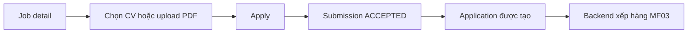
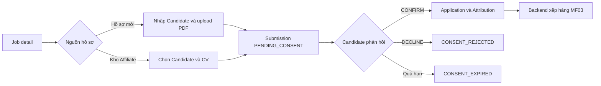

# MF02 — Tài liệu tích hợp Frontend

Tài liệu trong thư mục này chỉ mô tả các trang và luồng thuộc MF02: Candidate/CV Submission, consent, duplicate check, kho CV, Candidate Identity và audit liên quan. Schema chi tiết của từng DTO vẫn lấy từ Swagger của đúng phiên bản backend đang chạy.

## Danh sách trang

| File | Trang/luồng FE |
|---|---|
| [00-CONVENTIONS.md](./00-CONVENTIONS.md) | HTTP client, token, lỗi, pagination, concurrency |
| [01-CANDIDATE-APPLY.md](./01-CANDIDATE-APPLY.md) | Candidate chọn CV và ứng tuyển Job |
| [02-AFFILIATE-SUBMIT.md](./02-AFFILIATE-SUBMIT.md) | Affiliate nộp Candidate/CV mới hoặc từ kho |
| [03-AFFILIATE-SUBMISSIONS.md](./03-AFFILIATE-SUBMISSIONS.md) | Lịch sử Submission, chi tiết, resend consent và tiến độ referral |
| [04-CANDIDATE-CONSENT.md](./04-CANDIDATE-CONSENT.md) | Candidate có/không có tài khoản xem và phản hồi consent |
| [05-CANDIDATE-CV-LIBRARY.md](./05-CANDIDATE-CV-LIBRARY.md) | Candidate quản lý kho CV cá nhân |
| [06-CANDIDATE-AFFILIATE-CVS.md](./06-CANDIDATE-AFFILIATE-CVS.md) | Candidate xem, thu hồi reuse, adopt và xem usages của CV Affiliate |
| [07-AFFILIATE-CANDIDATE-LIBRARY.md](./07-AFFILIATE-CANDIDATE-LIBRARY.md) | Affiliate tái sử dụng Candidate/CV đã được đồng ý |
| [08-CANDIDATE-IDENTITY.md](./08-CANDIDATE-IDENTITY.md) | Candidate nhận lại hồ sơ cũ bằng email đăng ký hoặc Identity Claim |
| [09-ADMIN-IDENTITY-CLAIMS.md](./09-ADMIN-IDENTITY-CLAIMS.md) | Admin duyệt/từ chối claim cần đối chiếu thủ công |
| [10-ADMIN-AUDIT-LOGS.md](./10-ADMIN-AUDIT-LOGS.md) | Admin tra audit log của các thao tác MF02 |

## Luồng chính

### Candidate tự ứng tuyển

Candidate tự ứng tuyển không đi qua consent.

### Affiliate nộp Candidate/CV

Frontend không tự gọi API tạo Application, Attribution hoặc MF03. Backend thực hiện các bước đó sau khi Candidate đồng ý.

## Thứ tự FE nên triển khai

1. HTTP client và xử lý token/lỗi.
2. Candidate apply.
3. Affiliate submit và lịch sử Submission.
4. Hai trang consent: có tài khoản và link email công khai.
5. Kho CV hai phía.
6. Candidate Identity Claim.
7. Màn hình Admin Identity Claim và Audit Log.
