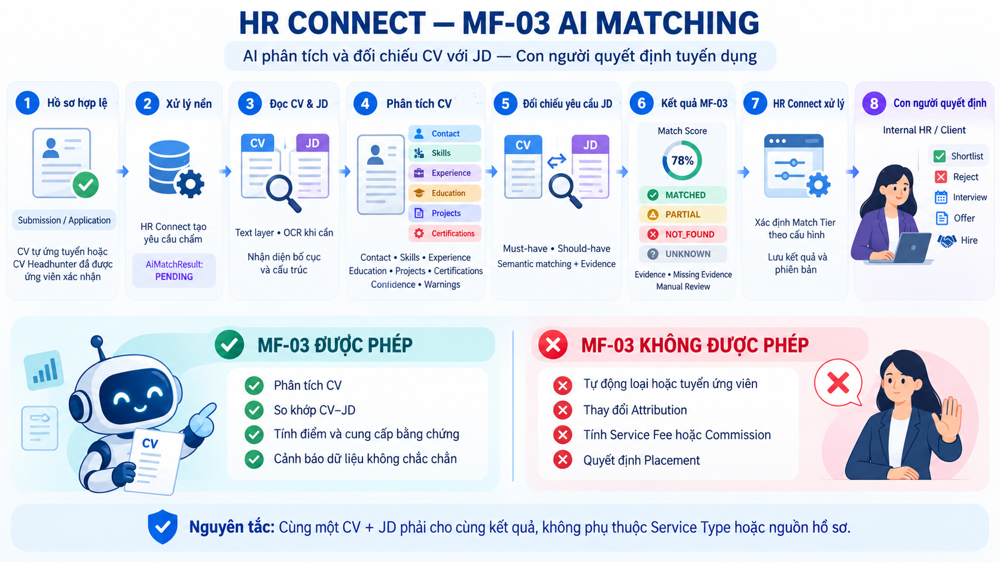

# MF-03 — AI Matching và hỗ trợ sàng lọc

## Luồng thực tế

1. HR Connect chỉ tạo yêu cầu MF-03 khi đã có `Application` và CV hợp lệ. Với hồ sơ từ Headhunter, ứng viên phải xác nhận consent trước.
2. Yêu cầu được lưu bền vững ở trạng thái `PENDING`; dispatcher gửi job sang AI Service ở background nên thao tác nộp CV không chờ AI xử lý xong.
3. AI Service lấy CV và JD qua internal API, đọc text layer hoặc OCR khi cần và nhận diện bố cục.
4. Parser trích xuất Contact, Skills, Experience, Education, Projects, Certifications cùng confidence, warnings và diagnostics.
5. Matcher đối chiếu từng yêu cầu MUST_HAVE/SHOULD_HAVE bằng rule, evidence và semantic similarity.
6. Mỗi yêu cầu được trả về một trong bốn trạng thái: `MATCHED`, `PARTIAL`, `NOT_FOUND`, `UNKNOWN`. `UNKNOWN` nghĩa là dữ liệu không đọc đủ, không có nghĩa ứng viên thiếu năng lực.
7. HR Connect tự ánh xạ `MatchScore` sang `MatchTierConfig`, lưu kết quả an toàn và hiển thị bằng chứng/cảnh báo cho người review.
8. Internal HR hoặc Client Company tự quyết định shortlist, reject, interview, offer và placement.

## Ranh giới bắt buộc

MF-03 được phép phân tích CV, đối chiếu CV–JD, tính điểm thực nghiệm, cung cấp bằng chứng và cảnh báo dữ liệu không chắc chắn.

MF-03 không được tự động shortlist/reject, thay đổi Attribution, tính Qualified/Counted CV, Service Fee hoặc Commission, tạo Offer hay quyết định Placement. Cùng một CV và JD phải cho cùng logic matching, không phụ thuộc Service Type hoặc nguồn hồ sơ.

## Chấm lại có kiểm soát

- `FAILED_RETRY`: thử lại attempt thất bại.
- `JD_UPDATED`: chấm lại bằng JD hiện tại sau khi JD thay đổi.
- `MANUAL_REVIEW`: HR yêu cầu chấm lại sau kiểm tra thủ công.

Không tạo lượt mới khi một attempt đang `PENDING` hoặc `PROCESSING`. Điểm và trọng số hiện vẫn là `EXPERIMENTAL`; kết quả AI là dữ liệu hỗ trợ, không phải quyết định tuyển dụng.
